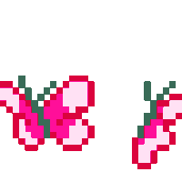
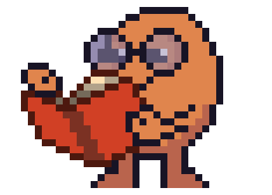

<h2> Hi, hi! I'm Kamsi!  </h2>
<details>
<summary>In case you missed it</summary>

```
.--.   .--.     ____    ,---.    ,---.   .-'''-. .-./`)  
|  | _/  /    .'  __ `. |    \  /    |  / _     \\ .-.') 
| (`' ) /    /   '  \  \|  ,  \/  ,  | (`' )/`--'/ `-' \ 
|(_ ()_)     |___|  /  ||  |\_   /|  |(_ o _).    `-'`"` 
| (_,_)   __    _.-`   ||  _( )_/ |  | (_,_). '.  .---.  
|  |\ \  |  |.'   _    || (_ o _) |  |.---.  \  : |   |  
|  | \ `'   /|  _( )_  ||  (_,_)  |  |\    `-'  | |   |  
|  |  \    / \ (_ o _) /|  |      |  | \       /  |   |  
`--'   `'-'   '.(_,_).' '--'      '--'  `-...-'   '---'  
                                                            
```
</details>
<p><em>
  Aspiring Software Engineer   </br>
  Ex Google SWE Intern  </br>
  Computer Science major, Mathematics minor at Howard University 
</em></p>


### A bit about me...

```javascript
const kamsi = {
  pronouns: "she" | "her",
  code: [Python, TypeScript, C, C++, Kotlin, JavaScript, SQL],
  tools: [React, Node.js, Docker, Apache Spark],
  favourite_color: 'pink',
  my_friends_call_me: [Kamsi, K, Kam],
  fun_fact: "I also go by Doreen!"
}
```

### Here's what I'm listening to 
<a>[](https://spotify-github-profile.kittinanx.com/api/view?uid=bloodybastards&redirect=true)</a>


 <em><b>Come say hi!</em>

<a href="https://www.linkedin.com/in/doreenonyewuchiohiri/">
  
</a>
<a href="https://www.instagram.com/dorrrreeeen/">
  
</a>
<a href="https://www.reddit.com/user/Friendly-Party-8102/">
  
</a>


